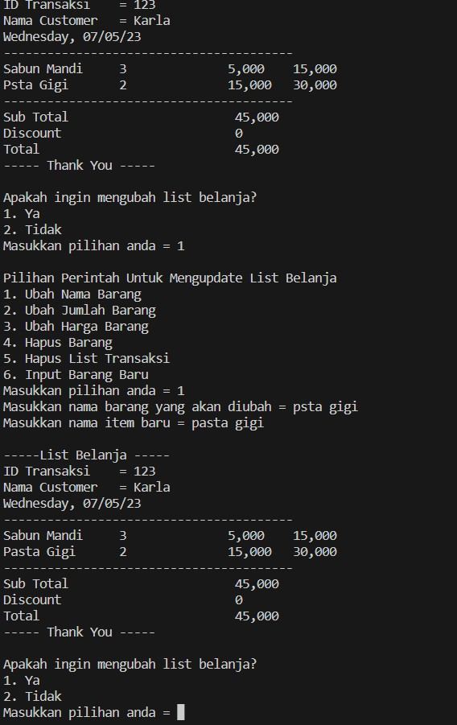
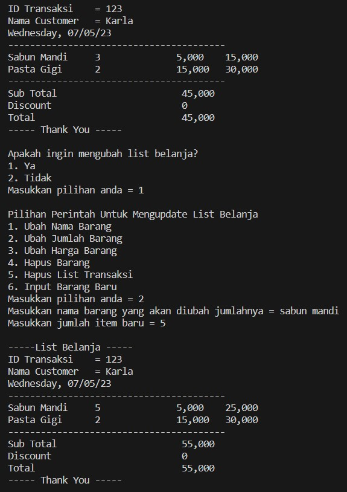

# Python Project Pacmann: Super Cashier
# A. Background Project
Sistem kasir self-service dibuat  dengan tujuan memudahkan customer untuk melakukan penginputan item belanjaannya sampai kepada tahap pembacayaran secara mandiri. Sistem ini dapat digunakan di supermarket atau di restoran. Dengan adanya sistem ini diharapkan dapat mengurangi antrian dikasir. 

# B. Tools
Sistem ini dibuat menggunakan bahasa pemrograman Python dan code editor Visual Code Studio

# C. Requirements/Objectives
Objectives yang terdapat dalam sistem ini adalah
1. Proses untuk menginput item belanjaan
2. Proses untuk menampilkan item yang telah di-input
3. Proses untuk mengecek apakah semua item yang di-input telah benar
4. Proses untuk menjumlahkan total belanjaan dan menentukan apakah mendapatkan diskon
5. Proses untuk mengganti nama item, jumlah item, dan harga item
6. proses untuk menghapus item dalam list
7. Proses untuk me-restart list

# D. Flowchart
Alur dalam sistem ini adalah
1. Customer akan menginput ID dan nama
2. Customer akan menginput item pada list dengan atribut nama item, jumlah item, dan harga item
3. Customer akan memilih apakah masih ingin menginput item
4. Jika customer masih ingin menginput item maka proses akan terulang pada langkah ke-2
5. Jika tidak maka sistem akan menampilkan semua item yang telah di input
6. Sistem akan menampilkan pilihan apakah customer ingin mengubah list item yang telah di input
7. Jika customer memilih untuk mengubah list maka akan tampil pilihan untuk mengubah list
8. Pilihan untuk mengubah list yang adalah 
    - mengganti nama item, jumlah item, harga item
    - menghapus item dalam list
    - me-restart list
9. Sistem akan menjalankan proses yang sesuai dengan pilihan customer
10. Sistem akan kembali menjalankan langkah ke-6 sampai customer tidak ingin mengubah list item
11. Jika customer tidak mengubah list maka akan tampil semua item yang telah diinput beserta total belanja dan diskon yang didapatkan
12. Sistem selesai

# E. Program Description
Program yang di tulis terdiri dari beberapa fungsi, berikut adalah penjelasannya
1. input_item berfungsi untuk menjalankan proses input item pada list

2. show_shopping_list berfungsi untuk menampilkan semua item yang telah diinput, menghitung dan menampilkan total belanja dan diskon
- code program tampilkan list belanja

- code program hitung diskon

3. found_index berfungsi untuk mencari index dari item yang diinput untuk kemudian dilakukan perubahan

4. update_item berfungsi untuk mengubah nama, jumlah, dan harga item

5. delete_item berfungsi untuk menghapus satu item di dalam list

6. clear_transaction berfungsi untuk menghapus semua item yang ada didalam list

7. check_shopping_list berfungsi untuk mengecek apakah list item sudah benar

# F. Test Cases & Results
Hasil Test Case
1. Input Item

2. Ubah Nama Item
- Jika item ditemukan

- Jika item tidak ditemukan

3. Ubah Jumlah Item

4. Ubah Nama Item

5. Hapus Item

6. Tambahitem kedalam list

7. Hapus List Belanja

# G. Conclusion
Sistem dapat melakukan proses input item, update item, hapus item, dan menghapus/ restart transaksi
# H. Future Work
Mengembangkan program dengan fungsi yang lebih kompleks. Misalnya menampilkan metode pembayaran untuk customer, membuat rekapan list transaksi untuk masing-masing customer, membuat rekapan list transaksi perhari yang dilakukan pada supermarket tersebut